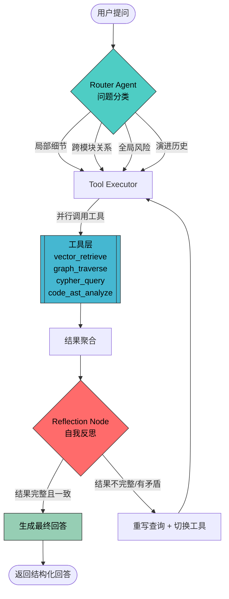

# Iris 项目架构设计文档

> **版本**：v1.0.0  
> **日期**：2026-03-22  
> **作者**：Iris Team  

---

## 目录

1. [项目概述与目标](#1-项目概述与目标)
2. [Agentic + GraphRAG 架构说明](#2-agentic--graphrag-架构说明)
3. [完整 Agent 流程图](#3-完整-agent-流程图)
4. [LangGraph State 定义](#4-langgraph-state-定义)
5. [工具列表及作用](#5-工具列表及作用)
6. [模块优先级处理逻辑](#6-模块优先级处理逻辑)
7. [LangGraph 可视化实现方案](#7-langgraph-可视化实现方案)
8. [config.yaml 字段详细说明](#8-configyaml-字段详细说明)
9. [部署与使用手册](#9-部署与使用手册)

---

## 1. 项目概述与目标

### 1.1 项目背景

在大型代码仓库中，新成员上手困难、跨模块依赖难以追踪、架构决策缺乏记录是普遍痛点。传统的代码文档工具要么停留在 API 签名层面，要么生成海量难以消化的文本，无法像一位资深架构师那样 **动态思考、关联分析、分层解读**。

**Iris**（虹膜——洞察之眼）应运而生：一个**私有化、智能化的代码讲解与知识库系统**，专为忙碌架构师设计。

### 1.2 核心目标

| 目标 | 描述 |
|------|------|
| **全仓深度解读** | 一次性对指定版本（tag/commit SHA）进行结构化解读，构建多层知识图谱 |
| **PR 增量演进** | Webhook 驱动，PR 合并后自动增量更新知识图谱，零人工干预 |
| **Agentic 智能问答** | 像真人架构师一样动态分类问题、并行调用工具、自我反思纠错 |
| **永不爆上下文** | GraphRAG 分层摘要 + Agent 按需拉取子图，无论仓库多大都不超限 |
| **自然语言交互** | 支持任意复杂度的中文/英文提问，按用户水平调整解释深度 |
| **模块优先级** | high/medium/low 三级精细控制解读深度和资源投入 |
| **全私有部署** | 数据全在本地，一键 Docker 部署，无外部依赖（除 LLM API） |

### 1.3 设计原则

- **Agent-First**：不是简单的 RAG pipeline，而是具备路由、反思、工具编排能力的 Agent 系统
- **Graph-Native**：知识以图（Neo4j）为核心载体，向量（Chroma）为辅助检索通道
- **Incremental-by-Design**：从数据模型到 Agent 流程，全面围绕增量更新设计
- **Observable**：LangGraph 流程完全可视化，每次查询可追溯完整推理链路

---

## 2. Agentic + GraphRAG 架构说明

### 2.1 传统 RAG vs Agentic GraphRAG

| 维度 | 传统 RAG | Iris Agentic GraphRAG |
|------|----------|----------------------|
| **检索方式** | 单一向量相似度 | 向量 + 图遍历 + Cypher 查询 + AST 分析 多通道 |
| **推理能力** | 无（检索→生成，一次性） | Router 分类 → 多工具并行 → 反思循环 → 自我纠错 |
| **上下文管理** | 固定 top-k chunk 拼接 | 分层摘要（文件→模块→社区→全仓）+ 按需子图提取 |
| **关系理解** | 弱（embedding 无法捕获调用链） | 强（PropertyGraph 建模函数调用、模块依赖、继承关系） |
| **跨模块分析** | 基本不可能 | 图遍历天然支持跨模块路径查询 |
| **幻觉控制** | 无反馈机制 | Reflection Node 检测不完整/矛盾，自动重写查询重执行 |
| **增量更新** | 需要全量重建索引 | 仅更新变更文件的子图 + 受影响社区摘要 |

### 2.2 系统架构总览

```
┌─────────────────────────────────────────────────────────────┐
│                        FastAPI Server                        │
│  ┌──────────┐  ┌──────────┐  ┌───────────┐  ┌────────────┐ │
│  │  /query   │  │/webhook  │  │/init-repo │  │/visualize  │ │
│  └─────┬────┘  └────┬─────┘  └─────┬─────┘  └─────┬──────┘ │
│        │            │              │               │         │
│  ┌─────▼────────────▼──────────────▼───────────────▼──────┐ │
│  │              LangGraph Agent Orchestrator               │ │
│  │  ┌────────┐  ┌───────────┐  ┌────────────┐            │ │
│  │  │ Router │→│ Tool Exec  │→│ Reflection  │→ loop/end  │ │
│  │  └────────┘  └───────────┘  └────────────┘            │ │
│  └────────────────────┬───────────────────────────────────┘ │
│                       │                                      │
│  ┌────────────────────▼───────────────────────────────────┐ │
│  │                   Tool Layer                            │ │
│  │  vector_retrieve │ graph_traverse │ cypher_query │ AST │ │
│  └──────┬───────────┬────────────────┬──────────────┬────┘ │
│         │           │                │              │       │
│  ┌──────▼───┐ ┌─────▼────┐  ┌───────▼───┐  ┌──────▼───┐  │
│  │  Chroma  │ │  Neo4j   │  │   Neo4j   │  │tree-sitter│  │
│  │(Vectors) │ │ (Graph)  │  │  (Cypher) │  │  (Parse)  │  │
│  └──────────┘ └──────────┘  └───────────┘  └──────────┘   │
└─────────────────────────────────────────────────────────────┘
```

### 2.3 数据流

1. **初始化流**：`/init-repo` → GitPython clone → tree-sitter 解析 → 构建 PropertyGraph → 写入 Neo4j + Chroma → 生成分层摘要
2. **增量流**：`/webhook` → 获取 PR diff → 仅解析变更文件 → 更新子图 + 受影响社区摘要
3. **查询流**：`/query` → LangGraph Agent（Router → Tools → Reflection → Answer）

---

## 3. 完整 Agent 流程图

### 3.1 主流程 Mermaid 图



### 3.2 Router 分类逻辑

| 问题类型 | 触发条件 | 使用工具组合 | 示例 |
|----------|----------|-------------|------|
| **局部细节** | 涉及单个文件/函数 | `vector_retrieve` + `code_ast_analyze` | "解释 auth.py 的 JWT 验证逻辑" |
| **跨模块关系** | 涉及多模块交互 | `graph_traverse` + `cypher_query` | "payment 模块如何影响 order 模块？" |
| **全局风险** | 涉及架构/安全/性能 | `cypher_query` + `vector_retrieve` + `graph_traverse` | "当前架构有哪些单点故障风险？" |
| **演进历史** | 涉及版本变化/PR | `vector_retrieve` + `graph_traverse` | "这个函数最近3次变更的原因？" |

### 3.3 Reflection 判断标准

Reflection Node 通过 LLM 自检以下维度：

1. **完整性**：回答是否覆盖了问题的所有方面？
2. **一致性**：多个工具返回的结果是否矛盾？
3. **可溯源性**：回答中的每个断言是否都有对应的代码/图证据？
4. **幻觉检测**：是否出现检索结果中不存在的代码片段或关系？

不通过任一维度 → 自动进入重写循环（最多 3 次）。

---

## 4. LangGraph State 定义

### 4.1 AgentState 完整定义

```python
from typing import TypedDict, Annotated, Literal
from langgraph.graph import add_messages
from langchain_core.messages import BaseMessage

class AgentState(TypedDict):
    # 消息历史（LangGraph 自动追加）
    messages: Annotated[list[BaseMessage], add_messages]

    # 用户原始问题
    user_query: str

    # Router 分类结果
    query_type: Literal["local_detail", "cross_module", "global_risk", "evolution"]

    # 当前应使用的工具列表
    selected_tools: list[str]

    # 向量检索结果
    vector_results: list[dict]

    # 图遍历结果
    graph_results: list[dict]

    # Cypher 查询结果
    cypher_results: list[dict]

    # AST 分析结果
    ast_results: list[dict]

    # 聚合后的上下文
    retrieved_context: str

    # Reflection 评价
    critique: str

    # Reflection 是否通过
    reflection_passed: bool

    # 当前反思循环次数
    reflection_count: int

    # 最大反思次数
    max_reflections: int

    # 最终生成的回答
    final_answer: str

    # 目标模块优先级
    module_priority: Literal["high", "medium", "low"]
```

### 4.2 State 流转说明

```
初始化:
  user_query = "用户问题"
  reflection_count = 0
  max_reflections = 3
  reflection_passed = False

Router 节点后:
  query_type = "cross_module"  (示例)
  selected_tools = ["graph_traverse", "cypher_query"]

Tool Executor 后:
  graph_results = [...]
  cypher_results = [...]
  retrieved_context = "聚合后的上下文文本"

Reflection 后:
  critique = "结果缺少 order 模块的调用链信息"
  reflection_passed = False
  reflection_count += 1

(重新执行后) Reflection 通过:
  reflection_passed = True
  final_answer = "完整的结构化回答"
```

---

## 5. 工具列表及作用

### 5.1 工具总览

| 工具名称 | 文件位置 | 数据源 | 作用 |
|----------|---------|--------|------|
| `vector_retrieve` | `utils/tools.py` | Chroma | 基于语义相似度检索代码片段和摘要 |
| `graph_traverse` | `utils/tools.py` | Neo4j | 从指定节点出发，遍历 N 跳邻居，获取调用链和依赖关系 |
| `cypher_query` | `utils/tools.py` | Neo4j | 执行自然语言转 Cypher 查询，支持复杂图模式匹配 |
| `code_ast_analyze` | `utils/tools.py` | 本地文件 | 使用 tree-sitter 实时解析代码 AST，提取函数签名、类结构、导入关系 |

### 5.2 工具详细说明

#### 5.2.1 vector_retrieve

```python
@tool
def vector_retrieve(query: str, top_k: int = 10, filters: dict = None) -> list[dict]:
    """
    基于语义相似度从 Chroma 向量数据库检索代码片段和文档摘要。

    适用场景：
    - 局部细节查询（函数实现、配置解释）
    - 模糊搜索（用户不知道确切的类名/函数名）
    - 获取文件级/模块级摘要

    返回：包含 content, metadata(file_path, module, priority), score 的字典列表
    """
```

#### 5.2.2 graph_traverse

```python
@tool
def graph_traverse(
    start_node: str,
    relationship_types: list[str] = None,
    max_depth: int = 3,
    direction: str = "both"
) -> list[dict]:
    """
    从指定节点出发，沿指定关系类型遍历知识图谱。

    适用场景：
    - 查看函数 A 调用了哪些函数（CALLS 关系）
    - 查看模块 X 依赖了哪些模块（DEPENDS_ON 关系）
    - 追踪数据流（DATA_FLOW 关系）

    关系类型：CALLS, DEPENDS_ON, INHERITS, IMPORTS, DATA_FLOW, CONTAINS
    返回：包含 nodes, edges, paths 的字典列表
    """
```

#### 5.2.3 cypher_query

```python
@tool
def cypher_query(natural_language_query: str) -> list[dict]:
    """
    将自然语言转换为 Cypher 查询并在 Neo4j 上执行。

    适用场景：
    - 复杂图模式匹配："找出所有被3个以上模块依赖的工具函数"
    - 聚合统计："每个模块的平均函数复杂度是多少？"
    - 路径查询："payment 到 notification 之间的最短调用路径"

    内部流程：NL → LLM 生成 Cypher → 执行 → 返回结果
    """
```

#### 5.2.4 code_ast_analyze

```python
@tool
def code_ast_analyze(
    file_path: str,
    analysis_type: str = "structure"
) -> dict:
    """
    使用 tree-sitter 实时解析代码文件的 AST。

    analysis_type 可选值：
    - "structure"：提取类、函数、方法的层次结构
    - "imports"：分析导入关系
    - "signatures"：提取所有函数签名及参数类型
    - "complexity"：计算圈复杂度

    适用场景：
    - 用户想了解某个文件的整体结构
    - 需要精确的函数签名信息（而非向量检索的模糊匹配）
    - 检测代码复杂度热点
    """
```

---

## 6. 模块优先级处理逻辑

### 6.1 优先级定义

用户在 `/init-repo` 时为每个模块指定优先级：

```yaml
modules:
  payment:
    priority: high
  order:
    priority: high
  utils:
    priority: medium
  scripts:
    priority: low
```

### 6.2 各优先级处理策略

#### HIGH（深度解读）

| 处理项 | 说明 |
|--------|------|
| **解读粒度** | 函数级：每个公开函数/方法都生成独立解读 |
| **架构权衡** | 分析"为什么这样设计"，与替代方案对比 |
| **关系图** | 完整的调用链 + 依赖图 + 数据流图 |
| **风险分析** | 标注潜在的性能瓶颈、安全风险、单点故障 |
| **摘要层数** | 4 层（函数 → 类 → 文件 → 模块） |
| **Neo4j 节点** | 函数、类、文件、模块全部入图 |
| **Chroma 切片** | 函数级 chunk（约 50-200 行） |

#### MEDIUM（核心逻辑）

| 处理项 | 说明 |
|--------|------|
| **解读粒度** | 文件级：每个文件一个核心逻辑摘要 |
| **核心逻辑** | 提取主要业务流程和关键函数 |
| **调用链** | 仅记录跨文件调用 |
| **摘要层数** | 3 层（文件 → 模块 → 社区） |
| **Neo4j 节点** | 关键函数、文件、模块入图 |
| **Chroma 切片** | 文件级 chunk（约 200-500 行） |

#### LOW（简要功能）

| 处理项 | 说明 |
|--------|------|
| **解读粒度** | 模块级：整个模块一个功能概述 |
| **摘要层数** | 2 层（文件 → 模块） |
| **Neo4j 节点** | 仅文件和模块入图 |
| **Chroma 切片** | 模块级 chunk |

### 6.3 优先级在 Agent 中的应用

当用户查询涉及某个模块时，Agent 根据该模块的优先级动态调整行为：

```python
if module_priority == "high":
    # 使用全部 4 个工具，返回深度分析
    selected_tools = ["vector_retrieve", "graph_traverse", "cypher_query", "code_ast_analyze"]
    response_depth = "detailed"
elif module_priority == "medium":
    # 使用向量检索 + 图遍历
    selected_tools = ["vector_retrieve", "graph_traverse"]
    response_depth = "standard"
else:  # low
    # 仅使用向量检索
    selected_tools = ["vector_retrieve"]
    response_depth = "brief"
```

---

## 7. LangGraph 可视化实现方案

### 7.1 总体方案

Iris 提供两种 LangGraph 可视化方式：

1. **静态文档嵌入**：在本设计文档中以 Mermaid 语法展示 Agent 流程图（见第 3 章）
2. **动态 API 端点**：通过 `/visualize-agent` 端点实时渲染当前 Agent 图结构

### 7.2 `/visualize-agent` 端点

```
GET /visualize-agent?format=mermaid    → 返回 Mermaid 文本
GET /visualize-agent?format=html       → 返回可直接在浏览器查看的 HTML 页面（内嵌 Mermaid.js）
GET /visualize-agent?format=png        → 返回 PNG 图片
```

#### HTML 渲染方案

```html
<!DOCTYPE html>
<html>
<head>
    <script src="https://cdn.jsdelivr.net/npm/mermaid/dist/mermaid.min.js"></script>
</head>
<body>
    <div class="mermaid">
        {{ mermaid_code }}
    </div>
    <script>mermaid.initialize({startOnLoad: true});</script>
</body>
</html>
```

### 7.3 `visualize_graph()` 函数

位于 `utils/visualize.py`，提供以下能力：

```python
def visualize_graph(graph: StateGraph, output_format: str = "mermaid") -> str | bytes:
    """
    将 LangGraph StateGraph 转换为可视化输出。

    参数：
        graph: 编译后的 LangGraph StateGraph
        output_format:
            - "mermaid": 返回 Mermaid 文本字符串
            - "mermaid_png": 返回 PNG 字节
            - "html": 返回完整 HTML 页面字符串

    实现方式：
        - 使用 graph.get_graph().draw_mermaid() 生成 Mermaid 语法
        - 使用 graph.get_graph().draw_mermaid_png() 生成 PNG（需要 pyppeteer）
        - HTML 模式将 Mermaid 文本嵌入到带 mermaid.js CDN 的 HTML 模板中
    """
```

### 7.4 运行追踪可视化

每次查询执行后，返回结果中附带本次推理的实际执行路径：

```json
{
    "answer": "...",
    "trace": {
        "nodes_visited": ["router", "tool_executor", "reflection", "tool_executor", "reflection", "generate"],
        "tools_used": ["graph_traverse", "cypher_query", "vector_retrieve"],
        "reflection_count": 2,
        "total_tokens": 3420,
        "mermaid_trace": "graph TD\n  ..."
    }
}
```

---

## 8. config.yaml 字段详细说明

```yaml
# ============================================================
# Iris 配置文件
# ============================================================

# --- 服务器配置 ---
server:
  host: "0.0.0.0"                    # 监听地址
  port: 8000                          # 监听端口
  workers: 1                          # Uvicorn worker 数量
  log_level: "info"                   # 日志级别: debug/info/warning/error

# --- LLM 配置 ---
llm:
  provider: "anthropic"               # LLM 提供商: anthropic / openai / grok
  model: "claude-sonnet-4-20250514"       # 模型名称
  api_key: "${ANTHROPIC_API_KEY}"     # API Key（支持环境变量引用）
  temperature: 0.1                    # 生成温度（低温=更确定性）
  max_tokens: 4096                    # 单次生成最大 token 数

# --- 嵌入模型配置 ---
embedding:
  provider: "anthropic"               # 嵌入模型提供商
  model: "voyage-code-2"             # 代码优化嵌入模型
  dimension: 1536                     # 向量维度

# --- Neo4j 图数据库配置 ---
neo4j:
  uri: "bolt://neo4j:7687"           # Neo4j Bolt 协议地址
  username: "neo4j"                   # 用户名
  password: "${NEO4J_PASSWORD}"       # 密码（支持环境变量引用）
  database: "iris"                    # 数据库名称

# --- Chroma 向量数据库配置 ---
chroma:
  host: "chroma"                      # Chroma 服务地址
  port: 8001                          # Chroma 服务端口
  collection_name: "iris_code"        # Collection 名称
  persist_directory: "./data/chroma"  # 持久化目录

# --- Git 配置 ---
git:
  clone_directory: "./data/repos"     # 仓库克隆目录
  platforms:                          # 支持的 Git 平台
    gitcode:
      base_url: "https://gitcode.com"
      api_token: "${GITCODE_TOKEN}"
    github:
      base_url: "https://api.github.com"
      api_token: "${GITHUB_TOKEN}"

# --- Agent 配置 ---
agent:
  max_reflections: 3                  # Reflection 最大循环次数
  max_tool_calls: 10                  # 单次查询最大工具调用次数
  vector_top_k: 10                    # 向量检索默认 top-k
  graph_max_depth: 3                  # 图遍历默认最大深度
  response_language: "zh-CN"          # 回答语言

# --- 代码解析配置 ---
parser:
  supported_languages:                # 支持解析的编程语言
    - python
    - javascript
    - typescript
    - java
    - go
    - rust
  max_file_size_kb: 500               # 单文件最大解析大小（KB）
  ignore_patterns:                    # 忽略的文件/目录模式
    - "node_modules/"
    - ".git/"
    - "__pycache__/"
    - "*.min.js"
    - "*.lock"
    - "dist/"
    - "build/"

# --- 模块优先级默认配置 ---
priority:
  default: "medium"                   # 未指定时的默认优先级
  chunk_sizes:                        # 各优先级的 chunk 大小（行数）
    high: 100
    medium: 300
    low: 1000
  summary_layers:                     # 各优先级的摘要层数
    high: 4
    medium: 3
    low: 2

# --- Webhook 配置 ---
webhook:
  secret: "${WEBHOOK_SECRET}"         # Webhook 签名密钥
  events:                             # 监听的事件类型
    - "merge_request"                 # GitCode
    - "pull_request"                  # GitHub
```

---

## 9. 部署与使用手册

### 9.1 前置要求

- Docker + Docker Compose
- LLM API Key（Anthropic / OpenAI / Grok 任选一）
- 目标 Git 仓库的访问权限（Token）

### 9.2 一键部署

```bash
# 1. 克隆 Iris
git clone https://github.com/your-org/iris.git
cd iris

# 2. 配置环境变量
cp .env.example .env
# 编辑 .env，填入：
#   ANTHROPIC_API_KEY=sk-ant-xxx
#   NEO4J_PASSWORD=your-password
#   GITCODE_TOKEN=xxx
#   GITHUB_TOKEN=xxx
#   WEBHOOK_SECRET=your-secret

# 3. 一键启动
docker-compose up -d

# 4. 验证服务
curl http://localhost:8000/health
# 返回: {"status": "healthy", "neo4j": "connected", "chroma": "connected"}
```

### 9.3 初始化全仓解读

```bash
# 指定仓库、版本和模块优先级进行初始化
curl -X POST http://localhost:8000/init-repo \
  -H "Content-Type: application/json" \
  -d '{
    "repo_url": "https://gitcode.com/your-org/your-project.git",
    "version": "v2.1.0",
    "platform": "gitcode",
    "modules": {
      "src/payment": "high",
      "src/order": "high",
      "src/utils": "medium",
      "scripts": "low"
    }
  }'

# 返回：
# {
#   "task_id": "init-abc123",
#   "status": "processing",
#   "estimated_time": "15-30 minutes (depends on repo size)"
# }

# 查询初始化进度
curl http://localhost:8000/init-repo/status/init-abc123
```

### 9.4 Webhook 配置

#### GitCode Webhook

1. 进入 GitCode 仓库 → 设置 → Webhooks
2. URL：`https://your-domain:8000/webhook/gitcode`
3. Secret：与 `.env` 中的 `WEBHOOK_SECRET` 一致
4. 事件：勾选 **Merge Request Events**（仅合并事件）

#### GitHub Webhook

1. 进入 GitHub 仓库 → Settings → Webhooks → Add webhook
2. Payload URL：`https://your-domain:8000/webhook/github`
3. Content type：`application/json`
4. Secret：与 `.env` 中的 `WEBHOOK_SECRET` 一致
5. Events：选择 **Pull requests**

### 9.5 查询示例

#### 简单查询

```bash
curl -X POST http://localhost:8000/query \
  -H "Content-Type: application/json" \
  -d '{
    "question": "解释 auth.py 中的 JWT 验证流程"
  }'
```

#### 复杂跨模块查询

```bash
curl -X POST http://localhost:8000/query \
  -H "Content-Type: application/json" \
  -d '{
    "question": "用中级架构师水平解释 payment 模块的 Redis 限流逻辑，为什么不用数据库？这个改动对 order 模块有什么影响？"
  }'

# 返回示例：
# {
#   "answer": "## Payment 模块 Redis 限流逻辑解析\n\n### 1. 限流实现 ...",
#   "trace": {
#     "nodes_visited": ["router", "tool_executor", "reflection", "tool_executor", "reflection", "generate"],
#     "tools_used": ["vector_retrieve", "graph_traverse", "cypher_query"],
#     "query_type": "cross_module",
#     "reflection_count": 2
#   },
#   "sources": [
#     {"file": "src/payment/rate_limiter.py", "lines": "45-78"},
#     {"file": "src/order/checkout.py", "lines": "120-135"}
#   ]
# }
```

### 9.6 可视化 Agent 图

```bash
# 在浏览器中直接打开（HTML + Mermaid.js 渲染）
open http://localhost:8000/visualize-agent?format=html

# 获取 Mermaid 源码
curl http://localhost:8000/visualize-agent?format=mermaid

# 下载 PNG 图片
curl -o agent_graph.png http://localhost:8000/visualize-agent?format=png
```

### 9.7 API 端点汇总

| 端点 | 方法 | 说明 |
|------|------|------|
| `/health` | GET | 健康检查 |
| `/init-repo` | POST | 初始化全仓解读 |
| `/init-repo/status/{task_id}` | GET | 查询初始化进度 |
| `/query` | POST | 智能问答 |
| `/webhook/gitcode` | POST | GitCode Webhook 接收 |
| `/webhook/github` | POST | GitHub Webhook 接收 |
| `/visualize-agent` | GET | Agent 图可视化 |

---

## 附录 A：Neo4j 图模型

### 节点类型

| 标签 | 属性 | 说明 |
|------|------|------|
| `Repository` | name, url, version | 仓库根节点 |
| `Module` | name, path, priority, summary | 模块节点 |
| `File` | name, path, language, summary | 文件节点 |
| `Class` | name, file_path, docstring, summary | 类节点 |
| `Function` | name, file_path, signature, complexity, summary | 函数节点 |
| `Community` | id, level, summary | 社区摘要节点（GraphRAG） |

### 关系类型

| 关系 | 方向 | 说明 |
|------|------|------|
| `CONTAINS` | Repository→Module→File→Class→Function | 包含关系 |
| `CALLS` | Function→Function | 函数调用 |
| `IMPORTS` | File→File | 导入关系 |
| `DEPENDS_ON` | Module→Module | 模块依赖 |
| `INHERITS` | Class→Class | 继承关系 |
| `DATA_FLOW` | Function→Function | 数据流向 |
| `BELONGS_TO` | *→Community | 社区归属 |

---

## 附录 B：分层摘要策略

```
Level 4 (全仓):  "Iris 是一个由 5 个核心模块组成的..."
    ↑ 聚合
Level 3 (社区):  "Payment + Order 社区负责核心交易流程..."
    ↑ 聚合
Level 2 (模块):  "Payment 模块实现了限流、计费、退款三大功能..."
    ↑ 聚合
Level 1 (文件):  "rate_limiter.py 使用 Redis 滑动窗口实现 API 限流..."
    ↑ 聚合
Level 0 (函数):  "check_rate_limit() 接收 user_id 和 endpoint，返回..."
```

Agent 查询时根据问题粒度选择合适的摘要层级，避免一次性加载过多上下文。

---

> **文档结束** — 等待确认后将进入第二步：逐文件生成完整代码。
